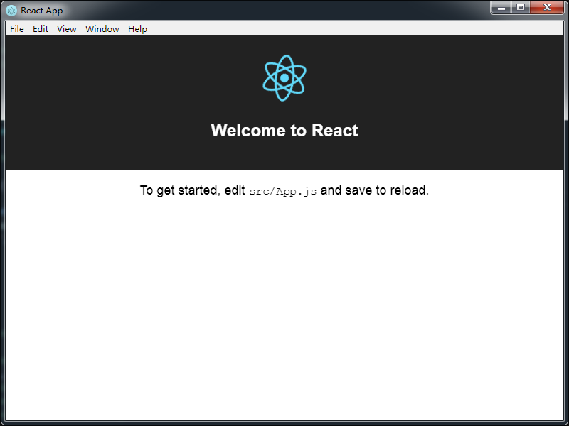

# 基于Electron的桌面应用

[[English]](README_EN.md)

- 介绍
> 这是一个简易的基于Electron的桌面应用； 你可以根据此仓库内容二次开发。 DEV阶段更友好的热更新机制

- 技术栈
  - Electron 16.10.2
  - 任何其他前端技术

- 更多教程
  [see here](https://www.jianshu.com/p/ea0852003209)